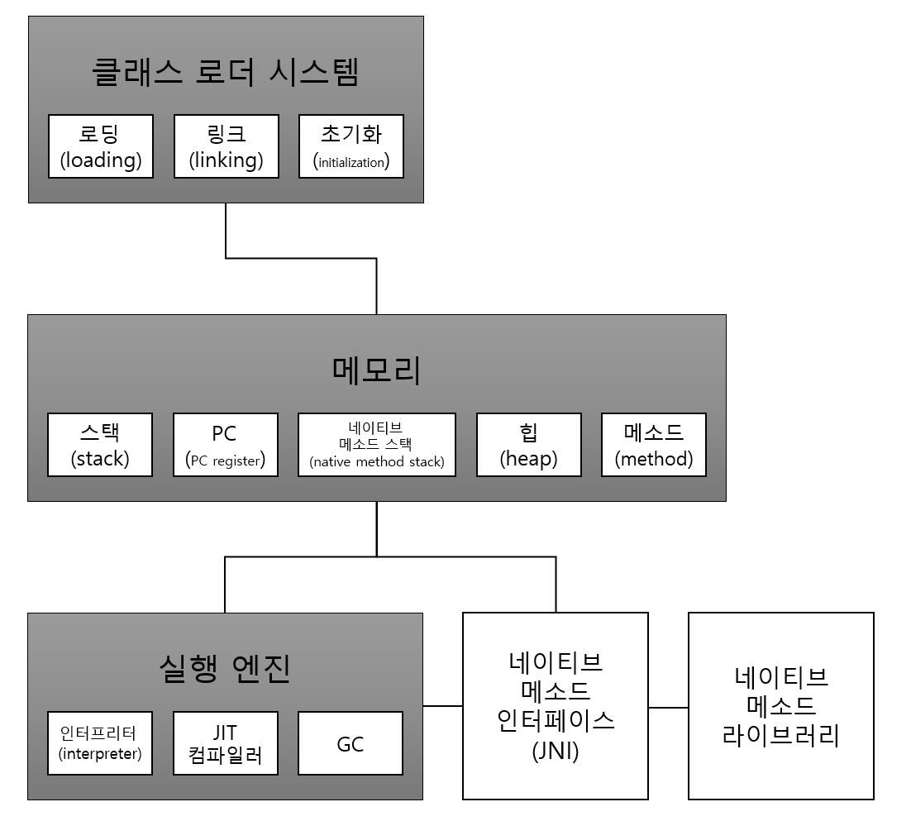

# The-JAVA
더 자바 - 백기선 수업내용 정리 레포

## JVM 이해하기
### JAVA, JVM, JDK, JRE 의 차이 이해하기
- JVM(Java Virtual Machine)
	- 자바 바이트코드(class 파일)를 OS가 이해할 수 있는 코드(인터프리터와 JIT 컴파일러)로 변환하여 실행한다.
	- 바이트 코드를 실행하는 표준이자 구현체 이다. (JVM 표준 스펙 및 각 벤더가 구현하는 JVM-오라클, 아마존 등 ...)

- JRE(JAVA Runtime Enviroment)
	- JVM + 라이브러리 
	- 자바 핵심 라이브러리 및 런타임 환경에서 사용하는 Property 세팅 및 리소스 파일을 가지고 있음.
	- 개발 관련 도구는 없다. (JDK에 포함)

- JDK(JAVA Development Kit)
	- JRE + 개발 도구
	- 오라클은 JAVA 11부터 JDK 만 제공

- JAVA
	- Programming Language
	- JDK 에 들어있는 자바 컴파일러(javac) 를 사용하여 바이트코드(class 파일) 로 컴파일 가능
	- Oracle JDK 11 버전부터 상용 사용시 유료

- JVM 언어
	- JVM 기반으로 동작하는 프로그래밍 언어
	- EX: 클로저, 그루비, JRuby, Jython, Kotlin, Scala ...

### JVM 구조

- 클래스 로더 시스템
  - Class 파일에서 바이트코드를 읽고 메모리에 저장
  - 로딩: 클래스를 읽어오는 과정
  - 링크: 레퍼런스를 연결하는 과정
  - 초기화: static 값들 초기화 및 변수에 할당
- 메모리
  - 클래스 수준의 정보들 (클래스 이름, 부모 클래스 이름, 메소드, 변수) 등을 저장
  - 공유 자원임
  - 힙 영역도 공유 자원이고 객체 정보를 저장
  - 스택 영역에는 스레드마다 런타임 스택을 쌓고, 그 안의 메소드 호출을 스택 프레임이라고 부르는 블럭으로 쌓는다
  - PC 레지스터: 스레드마다 스레드 내에 현재 실행할 스택 프레임을 가리키는 포인터가 생성된다.
- 실행 엔진
  - 인터프리터: 바이트 코드를 한줄씩 실행
  - JIT 컴파일러: 인터프리터의 효율을 높이기 위해 반복되는 코드를 네이티브 코드로 변경해둔다
  - GC: 더 이상 참조되지 않는 객체를 정리한다

- JNI
  - 자바 애플리케이션에서 C나 C++, 어셈블리로 작성된 함수를 사용할 수 있다.
  - native 키워드를 사용한 메소드를 호출한다.
- 네이티브 메소드 라이브러리
  - C, C++ 로 작성된 라이브러리

### 클래스 로더

- 로딩 -> 링크 -> 초기화 순으로 진행된다
- 로딩
  - 클래스 로더가 class 파일을 읽고 바이너리 데이터를 생성 후 `메소드` 영역에 저장
  - 메소드 영역에 저장하는 데이터
    - FQCN (Full Qualified Class Name)
    - Class, Interface, Enum
    - Methods, Variables
    - 로딩이 끝나면 해당 클래스 타입의 Class 객체를 힙 영역에 저장
- 링크
  - Verify, Prepare, Resolve(optional) 세 단계로 나누어져 있다.
  - Verify: class 파일 형식이 유효한지 체크한다.
  - Prepare:  클래스 변수와 기본값에 필요한 메모리를 준비한다.
  - Resolve: 심볼릭 메모리 레퍼런스를 메소드 영역에 있는 실제 레퍼런스로 교체한다.
- 초기화
  - Static 변수의 값을 할당한다.
  - Static 블럭을 실행한다.

- 세 가지 클래스 로더
  - 부트스트랩 클래스 로더
    - JAVA_HOME\lib 에 위치하고 있는 코어 자바 API를 제공한다.
    - **최상위** 우선순위 클래스 로더이다.
  - 플랫폼 클래스 로더
    - JAVA_HOME\lib\ext 폴더 또는 java.ext.dirs 시스템 변수에 해당하는 위치에 있는 클래스를 제공한다.
  - 애플리케이션 클래스 로더
    - 애플리케이션 클래스패스에서 클래스를 읽는다.
    - 클래스패스: `-classpath` 옵션 혹은 `java.class.path` 환경 변수의 값에 해당하는 위치
    
### 바이트 코드 조작 
